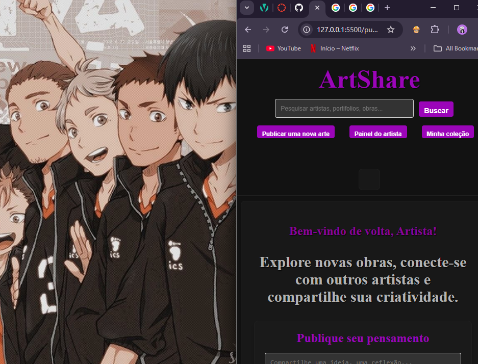
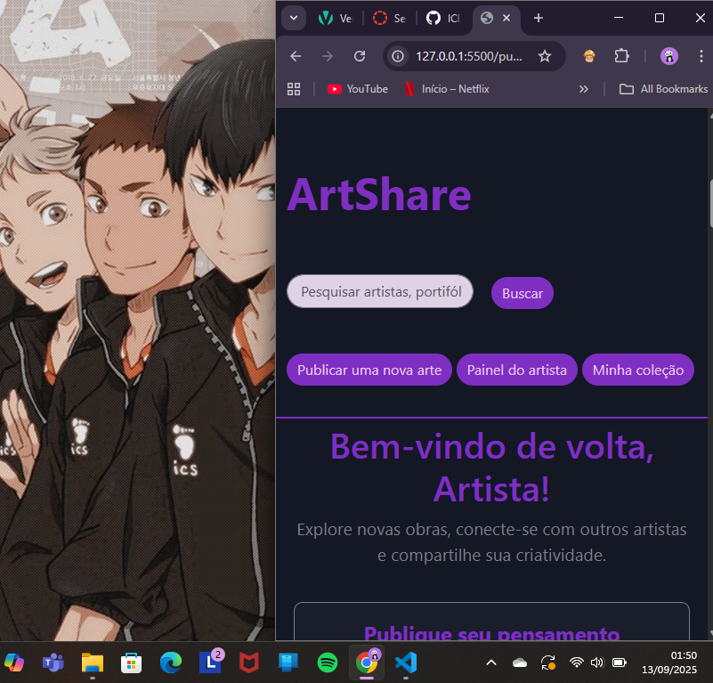

# Trabalho Prático - Semana 04 e 05

Dessa vez, vamos dar sequência ao projeto iniciado na semana passada. Se você ainda não fez o projeto da semana anterior, fique atento, se programe e procure colocar as atividades em dia. Volte lá, leia tudo e faça sua parte pois essa atividade depende da atividade anterior..

Nessa atividade,vamos evoluir o projeto para que a home-page funcione bem tanto no celular quanto no desktop, entendendo também como é o processo gradativo e colaborativo de desenvolvimento de um software, registrando cada etapa no histórico de commits do repositório do git/GitHub.

**IMPORTANTE:** Você deve trabalhar e alterar apenas arquivos dentro da pasta **`public`,** mantendo os arquivos **`index.html`** e **`styles.css`** com estes nomes. Deixe todos os demais arquivos e pastas desse repositório inalterados. **PRESTE MUITA ATENÇÃO NISSO.**

## Informações Gerais

- Nome:Erica Regina da Silva Martins 
- Matricula:00905541
- Proposta de projeto escolhida:Pessoas e produções
- Breve descrição sobre seu projeto:Meu projeto é criar uma rede que sirva de portifolio online para artistas, viabilizar a criação de comunidades para a disseminação de diferentes formas de arte, epor meio de recomendações das comunidades disseminar curiosidades sobre obras de artistas famosos, vivos ou não. Além disso, por meio do compartilhamento de albuns de musicas, garantir a identificação de gostos em comum.

## Print da versão responsiva com CSS puro

## Print da versão responsiva com Bootstrap

